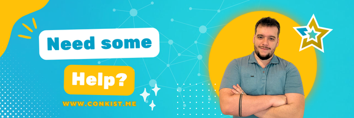
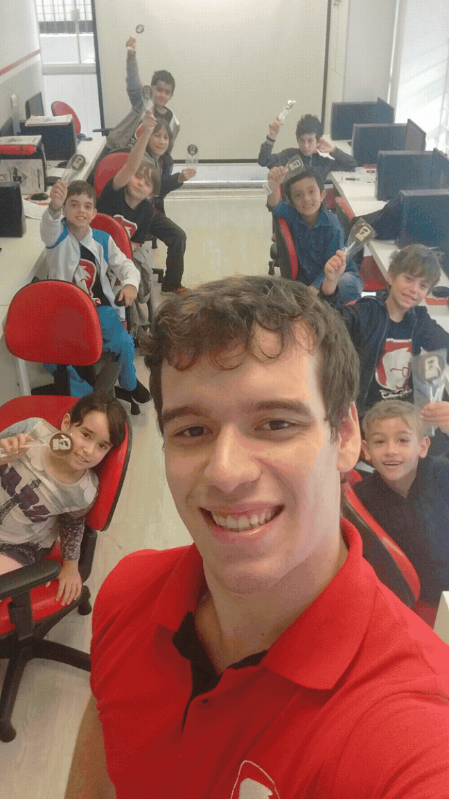

<h2 align="center">
   
  
   
  Renato Lima - FullStack Unity Developer and Founder at <a href="https://conkist.me" target="_blank">Conkist</a>
   
</h2>

Born and raised in the north of Brazil, I am a professional C# Developer with extensive expertise in Unity Game Engine, Design, and Production. With over 5 years of experience making mobile games, I started my own business to build my experience as a producer and founder at Conkist. I love sharing knowledge, building great relationships, and bringing joy to other's lives.

## Portfolio

    
    
    

*Hover for more details

## Soft Skills

Fluent English, Creativity, Clear Communication, Empathy, Open-minded, Innovation Hacking

## Technologies

  
  
  
  
  
  
  
  
  
  
  
  
  
  
  
  
  
  
  
  
  
  
  
  
  
  
  
  
  
  
  
  
  
  
  

###

  
  
  
  
  
  
  
  
  

###

AI & Tools: 

Microsoft Office + Copilot, Github Copilot, ChatGPT, StableDiffusion, HeyGen, ElevenLabs, N8N

### 
<h2 align="right">Contact Me</h2>

###

  
  
  

<h2 align="right">Additional Links</h2>

   
  Follow <a href="https://www.instagram.com/conkiststudio/"> Conkist</a> 
  Instagram <a href="https://conkist.me/links">Links</a> 
  <a href="https://wa.me/5591991185008">Request</a> a Service Budget 
  Support our Projects

